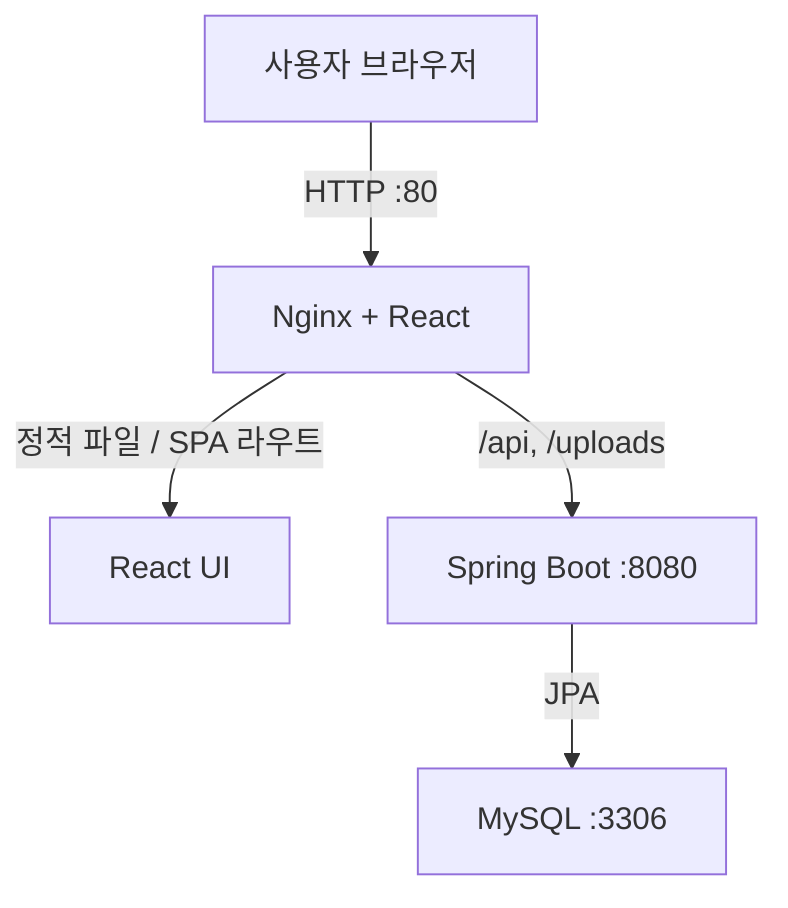

# 냐르륵

**냐르륵**은 고양이 감성과 보라색을 메인 콘셉트로 한 커뮤니티 서비스입니다.

Vanilla JavaScript로 만든 프론트엔드를 React로 마이그레이션하고, Spring Boot REST API와 JWT 인증을 연동했습니다. 기능 구현에 그치지 않고 EC2 단일 서버 직접 배포와 Docker Compose 기반 컨테이너 배포를 모두 구성해 개발 환경부터 운영 진입점까지의 전체 흐름을 경험했습니다.

> 서비스 주소: `http://43.200.106.173`  
> 현재는 도메인과 HTTPS 없이 HTTP 80 포트로 서비스합니다.

## 프로젝트 목표

- Vanilla JavaScript에서 React로 전환하며 컴포넌트와 State 중심 UI 설계 학습
- REST API를 기준으로 프론트엔드와 백엔드 책임 분리
- Spring Security와 JWT를 이용한 인증·인가 흐름 구현
- JPA 연관관계, 트랜잭션, 입력 검증, 파일 업로드 등 커뮤니티 서비스의 기본 품질 확보
- Nginx 리버스 프록시를 적용한 단일 진입점 구성
- EC2 직접 배포와 Docker Compose 배포 방식의 차이 이해
- 로컬 H2와 배포 MySQL을 Spring Profile로 분리

## 주요 기능

| 영역 | 기능 |
| --- | --- |
| 인증 | 회원가입, 로그인, 로그아웃, JWT Access Token 인증 |
| 회원 | 회원 정보 조회·수정, 비밀번호 변경, 회원 탈퇴, 프로필 이미지 |
| 게시글 | 목록·상세 조회, 작성, 수정, 삭제, 이미지 업로드 |
| 댓글 | 목록 조회, 작성, 수정, 삭제 |
| 권한 | 게시글·댓글 작성자만 수정 및 삭제 가능 |
| 공통 | 입력값 검증, 예외 처리, 인증 만료 처리, 업로드 파일 제공 |

## 기술 스택

### Frontend

| 구분 | 기술 |
| --- | --- |
| UI | React |
| Build | Vite, npm |
| Routing | React Router |
| HTTP | Fetch API |
| Style | CSS |
| Quality | ESLint |

### Backend

| 구분 | 기술 |
| --- | --- |
| Language | Java 21 |
| Framework | Spring Boot |
| Web/Security | Spring Web MVC, Spring Security, JWT |
| Persistence | Spring Data JPA |
| Database | H2(local), MySQL(prod) |
| Validation | Jakarta Bean Validation |
| Build | Gradle |

### Deployment

| 구분 | 기술 |
| --- | --- |
| Infrastructure | AWS EC2, Elastic IP |
| Web/Proxy | Nginx |
| Container | Docker, Docker Compose |
| Image Build | React·Spring Boot 멀티스테이지 Dockerfile |
| External Port | HTTP 80 |

## 저장소 구조

```text
community-service/
├── client-react/              # React 프론트엔드
│   ├── src/
│   │   ├── api/
│   │   ├── assets/
│   │   ├── components/
│   │   ├── pages/
│   │   └── styles/
│   ├── Dockerfile             # React build → Nginx runtime
│   ├── nginx.conf             # SPA fallback 및 API 프록시
│   ├── package.json
│   └── vite.config.js
├── server/                    # Spring Boot 백엔드
│   ├── src/
│   │   ├── main/
│   │   │   ├── java/
│   │   │   └── resources/
│   │   └── test/
│   ├── Dockerfile             # Gradle/JDK build → JRE runtime
│   ├── build.gradle
│   ├── gradlew
│   └── settings.gradle
├── compose.yml                # Frontend·Backend·MySQL 통합 실행
├── .env.example               # 배포 환경 변수 예시
├── .gitignore
└── README.md
```

## 전체 요청 흐름



1. 사용자는 Elastic IP의 80 포트로 접속합니다.
2. Nginx가 React 정적 파일을 제공합니다.
3. `/api/**`와 `/uploads/**` 요청은 Spring Boot로 프록시합니다.
4. Spring Boot는 JWT 인증과 비즈니스 규칙을 처리합니다.
5. 배포 환경의 데이터는 MySQL에 저장됩니다.

## 인증 및 권한 처리

1. 사용자가 이메일과 비밀번호로 로그인합니다.
2. Spring Boot가 자격 증명을 검증하고 JWT Access Token을 발급합니다.
3. React는 인증 요청에 `Authorization: Bearer {token}`을 포함합니다.
4. JWT 필터가 토큰을 검증하고 인증 객체를 생성합니다.
5. 게시글·댓글 수정 및 삭제 시 인증 사용자와 작성자를 비교합니다.
6. 인증 실패는 `401`, 인증되었지만 권한이 부족하면 `403`으로 처리합니다.

프론트엔드의 버튼 숨김과 수정 페이지 접근 검사는 UX를 위한 1차 처리이며, 최종 권한 검증은 백엔드가 담당합니다. Refresh Token은 사용하지 않아 Access Token이 만료되면 다시 로그인합니다.

## API 요약

| 도메인 | 기본 경로 | 기능 |
| --- | --- | --- |
| 인증 | `/api/auth` | 로그인, 로그아웃 |
| 회원 | `/api/users` | 가입, 조회, 수정, 비밀번호 변경, 탈퇴 |
| 게시글 | `/api/posts` | 목록, 상세, 작성, 수정, 삭제 |
| 댓글 | `/api/posts/{postId}/comments` | 목록, 작성, 수정, 삭제 |
| 파일 | `/uploads/**` | 프로필·게시글 이미지 조회 |

상세 요청·응답 형식은 백엔드 Controller와 DTO를 기준으로 합니다.

## 실행 환경

| 환경 | Frontend | Backend | Database | 진입점 |
| --- | --- | --- | --- | --- |
| Local | Vite dev server | Spring Boot `local` profile | H2 | `localhost:5173` |
| EC2 직접 배포 | Nginx 정적 파일 | 실행 JAR | 배포 설정 | Elastic IP:80 |
| Docker Compose | Nginx 컨테이너 | `backend` 컨테이너, `prod` profile | MySQL 8.4 `db` 컨테이너 | Elastic IP:80 |

## 로컬 개발 환경 실행

### 1. 저장소 복제

```bash
git clone <INTEGRATED_REPOSITORY_URL>
cd community-service
```

### 2. 백엔드 실행

```bash
cd server
SPRING_PROFILES_ACTIVE=local ./gradlew bootRun
```

Windows에서는 다음과 같이 실행합니다.

```powershell
$env:SPRING_PROFILES_ACTIVE="local"
./gradlew.bat bootRun
```

백엔드 기본 주소는 `http://localhost:8080`이며 로컬 DB는 H2를 사용합니다.

### 3. 프론트엔드 실행

새 터미널에서 실행합니다.

```bash
cd client-react
npm install
npm run dev
```

`client-react/.env` 예시:

```env
VITE_API_BASE_URL=http://localhost:8080/api
```

Vite 기본 주소는 일반적으로 `http://localhost:5173`입니다.

## 빌드 및 테스트

### Frontend

```bash
cd client-react
npm run lint
npm run build
```

### Backend

```bash
cd server
./gradlew test
./gradlew clean build
```

## 배포 1: EC2 직접 설치 + Nginx 리버스 프록시

React와 Spring Boot를 EC2 1대에 직접 배치하고 Nginx를 앞단에 구성했습니다.

### 구성

- React: `npm run build`로 생성한 `dist/`를 Nginx가 정적 파일로 제공
- Spring Boot: Gradle로 생성한 실행 JAR을 EC2에서 구동
- Nginx: `/api/**`, `/uploads/**` 요청을 Spring Boot로 전달
- 외부 접속: `http://43.200.106.173`
- 공개 포트: HTTP 80

### 동작 확인

```bash
curl -I http://<ELASTIC_IP>/
curl -I http://<ELASTIC_IP>/api/posts
```

`/` 요청이 `200 OK`를 반환하고 API 요청이 Nginx를 거쳐 Spring Boot에 도달하는지 확인했습니다.

## 배포 2: 멀티스테이지 Dockerfile + Docker Compose

프론트엔드, 백엔드, 데이터베이스를 Compose로 통합했습니다.

### 멀티스테이지 이미지

| 대상 | Build stage | Runtime stage | 목적 |
| --- | --- | --- | --- |
| React | Node에서 의존성 설치 및 Vite build | Nginx에서 `dist/` 제공 | Node와 소스가 없는 경량 운영 이미지 |
| Spring Boot | JDK/Gradle에서 JAR build | JRE에서 JAR 실행 | 빌드 도구가 없는 경량 운영 이미지 |

### Compose 서비스

| 서비스 | 역할 | 네트워크/포트 |
| --- | --- | --- |
| `frontend` | Nginx + React 정적 파일 + 리버스 프록시 | 외부 `80:80` |
| `backend` | Spring Boot API | 내부 8080 |
| `db` | MySQL 8.4 | 내부 3306 |

### 영속 데이터

| Volume | 연결 경로 | 보존 데이터 |
| --- | --- | --- |
| `mysql-data` | `/var/lib/mysql` | MySQL 데이터 |
| `upload-data` | `/app/uploads` | 프로필·게시글 이미지 |

컨테이너를 다시 생성해도 DB와 업로드 파일이 유지되도록 애플리케이션 컨테이너와 데이터 생명주기를 분리했습니다.

### 환경 변수

루트의 `.env.example`을 복사해 `.env`를 만들고 실제 값을 입력합니다.

```env
MYSQL_DATABASE=community_service
MYSQL_USER=<DB_USERNAME>
MYSQL_PASSWORD=<DB_PASSWORD>
MYSQL_ROOT_PASSWORD=<DB_ROOT_PASSWORD>

SPRING_PROFILES_ACTIVE=prod
SPRING_DATASOURCE_URL=jdbc:mysql://db:3306/community_service
SPRING_DATASOURCE_USERNAME=<DB_USERNAME>
SPRING_DATASOURCE_PASSWORD=<DB_PASSWORD>
JWT_SECRET=<SUFFICIENTLY_LONG_RANDOM_SECRET>
FILE_UPLOAD_DIR=/app/uploads
```

### 실행

```bash
docker compose up -d --build
docker compose ps
docker compose logs -f backend
```

종료:

```bash
docker compose down
```

## Nginx 리버스 프록시

| Location | 처리 |
| --- | --- |
| `/` | React 파일 제공, 없는 경로는 `index.html`로 fallback |
| `/api/` | `http://backend:8080`으로 프록시 |
| `/uploads/` | `http://backend:8080`으로 프록시 |

Nginx를 단일 진입점으로 두어 다음 문제를 해결했습니다.

- React Router 경로를 새로고침할 때 발생하는 404
- 프론트엔드와 API의 서로 다른 Origin으로 인한 운영 CORS 부담
- Spring Boot 8080 포트의 직접 노출
- 컨테이너 IP 변경 문제: Compose 서비스명 `backend`로 통신

## Spring Profile과 데이터베이스 분리

- `application.yml`: 공통 설정
- `application-local.yml`: H2 기반 로컬 개발 설정
- `application-prod.yml`: 환경 변수 기반 MySQL·JWT·업로드 설정

Compose는 백엔드에 `SPRING_PROFILES_ACTIVE=prod`를 전달하고 서비스명 `db`로 MySQL에 연결합니다. 이를 통해 로컬에서는 설치가 간단한 H2를 유지하면서 배포 환경에서는 MySQL을 사용할 수 있습니다.

## 향후 개선

- 도메인 연결 및 HTTPS 적용
- GitHub Actions 기반 CI/CD 구축
- Docker 이미지 Registry 저장 및 버전 기반 배포
- Swagger/OpenAPI 문서화
- 프론트엔드 E2E 및 백엔드 통합 테스트 확대
- MySQL과 업로드 파일을 RDS·객체 스토리지로 분리
- 조회수 및 좋아요·싫어요 기능의 정합성까지 고려한 고도화
