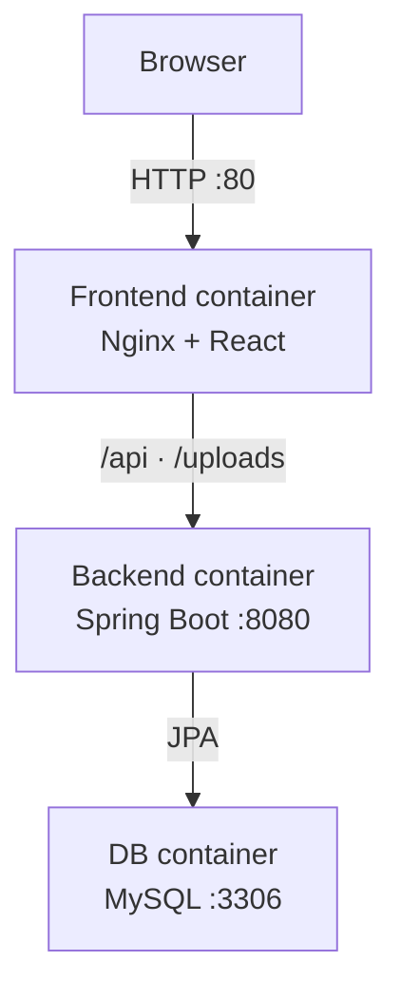
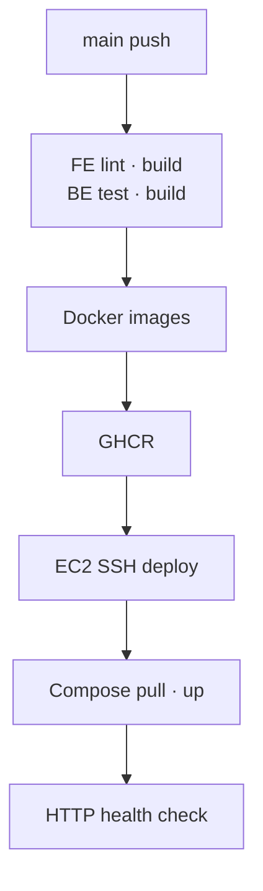

# 냐르륵

**냐르륵**은 고양이 감성과 보라색을 콘셉트로 한 커뮤니티 서비스입니다.

Vanilla JavaScript로 만든 프론트엔드를 React로 마이그레이션하고 Spring Boot REST API 및 JWT 인증과 연동했습니다. React·Spring Boot 멀티스테이지 Dockerfile과 Docker Compose로 실행 환경을 통합했으며, Nginx를 단일 진입점으로 두고 AWS EC2에 배포했습니다. GitHub Actions CI/CD 파이프라인을 통해 코드 검증부터 Docker 이미지 게시와 EC2 자동 배포까지 연결했습니다.

> 서비스 주소: `http://43.200.106.173`  
> 현재는 도메인과 HTTPS 없이 HTTP 80을 사용합니다.

## 프로젝트 목표

- Vanilla JavaScript에서 React로 전환하며 컴포넌트와 State 중심 UI 설계 학습
- REST API를 기준으로 프론트엔드와 백엔드 책임 분리
- Spring Security와 JWT를 이용한 인증·인가 구현
- 로컬 H2와 운영 MySQL을 Spring Profile로 분리
- React와 Spring Boot에 멀티스테이지 Docker build 적용
- Nginx 리버스 프록시를 이용한 단일 외부 진입점 구성
- GitHub Actions, GHCR, EC2를 연결한 자동 배포 파이프라인 구현

## 주요 기능

| 영역 | 기능 |
| --- | --- |
| 인증 | 회원가입, 로그인, 로그아웃, JWT Access Token 인증 |
| 회원 | 회원 조회·수정, 비밀번호 변경, 회원 탈퇴, 프로필 이미지 |
| 게시글 | 목록·상세 조회, 작성, 수정, 삭제, 이미지 업로드 |
| 댓글 | 목록 조회, 작성, 수정, 삭제 |
| 권한 | 게시글·댓글 작성자만 수정 및 삭제 가능 |
| 공통 | 입력값 검증, 예외 처리, 인증 만료 처리, 업로드 파일 제공 |

## 기술 스택

### Frontend

| 구분 | 기술 |
| --- | --- |
| UI | React |
| Build | Vite, Node.js 24, npm |
| Routing | React Router |
| HTTP | Fetch API |
| Style/Quality | CSS, ESLint |

### Backend

| 구분 | 기술 |
| --- | --- |
| Language | Java 21 |
| Framework | Spring Boot |
| Web/Security | Spring Web MVC, Spring Security, JWT |
| Persistence | Spring Data JPA |
| Database | H2(local), MySQL(prod) |
| Build | Gradle, Gradle Wrapper |

### DevOps

| 구분 | 기술 |
| --- | --- |
| Infrastructure | AWS EC2, Elastic IP |
| Web/Proxy | Nginx |
| Container | Docker, Docker Compose, 멀티스테이지 빌드 |
| Registry | GitHub Container Registry(GHCR) |
| CI/CD | GitHub Actions, SSH 기반 EC2 자동 배포 |
| External Port | HTTP 80 |

## 저장소 구조

```text
community-service/
├── client/
│   ├── src/
│   │   ├── api/
│   │   ├── assets/
│   │   ├── components/
│   │   ├── pages/
│   │   └── styles/
│   ├── Dockerfile             # Node build → Nginx runtime
│   ├── nginx.conf             # SPA fallback, API·uploads 프록시
│   ├── package.json
│   └── vite.config.js
├── server/
│   ├── src/
│   │   ├── main/
│   │   │   ├── java/
│   │   │   └── resources/
│   │   └── test/
│   ├── Dockerfile             # JDK/Gradle build → JRE runtime
│   ├── build.gradle
│   ├── gradlew
│   └── settings.gradle
├── .github/
│   └── workflows/             # CI/CD Workflow
├── compose.yml                # frontend, backend, db 통합 실행
├── .env.example               # 운영 환경 변수명 예시
├── .gitignore
└── README.md
```

## 서비스 아키텍처



1. 사용자는 Elastic IP의 HTTP 80으로 접속합니다.
2. Nginx가 React 정적 파일을 제공합니다.
3. `/api/**`와 `/uploads/**`는 Spring Boot `backend:8080`으로 프록시합니다.
4. Spring Boot가 인증, 비즈니스 로직, 데이터 접근을 처리합니다.
5. 운영 데이터는 MySQL과 Named Volume에 저장됩니다.

Spring Boot 8080과 MySQL 3306은 Compose 내부 통신용이며 인터넷에 직접 공개하지 않습니다.

## 인증 및 권한 처리

1. 사용자가 이메일과 비밀번호로 로그인합니다.
2. Spring Boot가 비밀번호를 검증하고 JWT Access Token을 발급합니다.
3. React는 인증 요청에 `Authorization: Bearer {token}`을 포함합니다.
4. JWT 필터가 토큰을 검증하고 인증 객체를 생성합니다.
5. 게시글·댓글 수정 및 삭제 시 인증 사용자와 작성자를 비교합니다.
6. 인증 실패는 `401`, 인증되었지만 권한이 부족하면 `403`으로 처리합니다.

프론트엔드의 버튼 숨김과 수정 페이지 접근 검사는 UX를 위한 처리이고 최종 인가는 백엔드가 담당합니다. Refresh Token은 사용하지 않아 Access Token이 만료되면 다시 로그인합니다.

## API 요약

| 도메인 | 기본 경로 | 기능 |
| --- | --- | --- |
| 인증 | `/api/auth` | 로그인, 로그아웃 |
| 회원 | `/api/users` | 가입, 조회, 수정, 비밀번호 변경, 탈퇴 |
| 게시글 | `/api/posts` | 목록, 상세, 작성, 수정, 삭제 |
| 댓글 | `/api/posts/{postId}/comments` | 목록, 작성, 수정, 삭제 |
| 파일 | `/uploads/**` | 프로필·게시글 이미지 조회 |

## 환경별 구성

| 환경 | Frontend | Backend | Database | 진입점 |
| --- | --- | --- | --- | --- |
| Local | Vite dev server | Spring Boot `local` | H2 | `localhost:5173` |
| EC2 직접 배포 | Host Nginx | 실행 JAR | 운영 DB 설정 | Elastic IP:80 |
| Docker Compose | Nginx container | `backend`, `prod` | MySQL `db` | Elastic IP:80 |

## 로컬 개발 환경

### 1. 저장소 복제

```bash
git clone <INTEGRATED_REPOSITORY_URL>
cd community-service
```

### 2. 백엔드 실행

macOS/Linux:

```bash
cd server
SPRING_PROFILES_ACTIVE=local ./gradlew bootRun
```

Windows PowerShell:

```powershell
cd server
$env:SPRING_PROFILES_ACTIVE="local"
./gradlew.bat bootRun
```

백엔드 기본 주소는 `http://localhost:8080`이며 H2를 사용합니다.

### 3. 프론트엔드 실행

새 터미널에서 실행합니다.

```bash
cd client-react
npm ci
npm run dev
```

`client/.env`:

```env
VITE_API_BASE_URL=http://localhost:8080/api
```

## 검사 및 빌드

Frontend:

```bash
cd client
npm run lint
npm run build
```

Backend:

```bash
cd server
./gradlew test
./gradlew clean build
```

## Docker Compose 실행

루트의 `.env.example`을 복사해 `.env`를 만들고 실제 값을 입력합니다.

```env
MYSQL_DATABASE=community_service
MYSQL_USER=<DB_USERNAME>
MYSQL_PASSWORD=<DB_PASSWORD>
MYSQL_ROOT_PASSWORD=<DB_ROOT_PASSWORD>

SPRING_PROFILES_ACTIVE=prod
SPRING_DATASOURCE_URL=jdbc:mysql://db:3306/community_service
SPRING_DATASOURCE_USERNAME=<DB_USERNAME>
SPRING_DATASOURCE_PASSWORD=<DB_PASSWORD>
JWT_SECRET=<BASE64_ENCODED_RANDOM_SECRET>
JWT_EXPIRATION=3600000
FILE_UPLOAD_DIR=/app/uploads
```

실행:

```bash
docker compose up -d --build
docker compose ps
docker compose logs -f backend
```

종료:

```bash
docker compose down
```

`docker compose down -v`는 MySQL과 업로드 Volume까지 삭제하므로 데이터 삭제가 필요한 경우가 아니면 사용하지 않습니다.

### Compose 서비스

| 서비스 | 역할 | 포트 |
| --- | --- | --- |
| `frontend` | Nginx, React 정적 파일, 리버스 프록시 | 외부 `80:80` |
| `backend` | Spring Boot REST API | 내부 8080 |
| `db` | MySQL | 내부 3306 |

### 영속 데이터

| Volume | 연결 경로 | 데이터 |
| --- | --- | --- |
| `mysql-data` | `/var/lib/mysql` | MySQL 데이터 |
| `upload-data` | `/app/uploads` | 프로필·게시글 이미지 |

## 멀티스테이지 Docker build

| 대상 | Build stage | Runtime stage |
| --- | --- | --- |
| React | Node에서 `npm ci`, Vite build | Nginx에서 `dist/` 제공 |
| Spring Boot | JDK/Gradle에서 JAR build | JRE에서 JAR 실행 |

빌드 도구와 전체 소스를 운영 이미지에서 제외해 이미지 크기와 불필요한 실행 요소를 줄였습니다.

## Nginx 리버스 프록시

| Location | 처리 |
| --- | --- |
| `/` | React 파일 제공, 없는 경로는 `index.html` fallback |
| `/api/` | `http://backend:8080`으로 프록시 |
| `/uploads/` | `http://backend:8080`으로 프록시 |

Nginx를 단일 진입점으로 두어 React Router 새로고침 404, 운영 CORS 부담, Spring Boot 8080 직접 노출 문제를 줄였습니다. 컨테이너 IP 대신 Compose 서비스명 `backend`를 사용합니다.

## CI/CD 파이프라인

GitHub Actions는 CI에서 검증된 결과물을 Docker 이미지로 고정하고, GHCR을 통해 EC2의 CD 단계로 전달합니다.



### Frontend CI

1. Node.js 24 설정 및 npm cache 적용
2. `npm ci`
3. `npm run lint`
4. `VITE_API_BASE_URL=/api`로 React build
5. 멀티스테이지 Docker 이미지 build 및 GHCR push

### Backend CI

1. Java 21 설정 및 Gradle cache 적용
2. Gradle Wrapper로 테스트와 build
3. 멀티스테이지 Docker 이미지 build 및 GHCR push

### CD

1. 모든 필수 CI Job 성공 확인
2. GitHub Actions가 SSH로 EC2 접속
3. EC2가 GHCR에서 새 이미지 pull
4. `docker compose up -d`로 변경된 서비스 재생성
5. MySQL과 업로드 Volume 유지
6. 컨테이너 상태와 `http://43.200.106.173` 응답 확인

커밋 SHA 태그를 함께 게시하면 실행 중인 이미지가 어떤 커밋에서 만들어졌는지 추적할 수 있습니다. 운영 배포 대상을 SHA 태그 또는 Digest로 고정하면 `latest` 태그만 사용하는 것보다 재현성과 롤백 가능성이 높아집니다.

### 인증 정보 관리

| 값 | 저장 위치 | 최소 권한/용도 |
| --- | --- | --- |
| GHCR push 인증 | GitHub Actions | `GITHUB_TOKEN`, `packages: write` |
| EC2 SSH 키 | GitHub Actions Secrets | 배포 서버 접속 |
| Private image pull 토큰 | GitHub Secrets 또는 EC2 환경 | `read:packages` |
| DB/JWT 값 | EC2 `.env` | 컨테이너 런타임 설정 |

서로 다른 private 저장소의 Workflow 또는 Package에 접근해야 할 때만 해당 범위의 별도 PAT를 사용합니다. PAT와 SSH 키, DB 비밀번호, JWT Secret은 README·Workflow 본문·Compose 파일에 직접 작성하지 않습니다.

## 보안 및 운영 원칙

- `.env`, JWT Secret, DB 비밀번호, PAT, SSH 키를 Git에 커밋하지 않습니다.
- GitHub Actions에는 Job별 최소 `permissions`만 부여합니다.
- Spring Boot 8080과 MySQL 3306은 외부에 공개하지 않습니다.
- 작성자 권한은 프론트엔드 UI가 아닌 백엔드에서 최종 검증합니다.
- MySQL과 업로드 파일은 Named Volume으로 영속화합니다.
- 현재 HTTP 구성이므로 도메인 확보 후 HTTPS 적용이 필요합니다.

## 저장소 운영

- 프론트엔드 저장소: React 코드, Nginx 설정, FE Dockerfile·Workflow 관리
- 백엔드 저장소: Spring Boot 코드, BE Dockerfile·Workflow 관리
- 통합 저장소: `client`, `server`, Compose 및 전체 아키텍처 관리

분리 저장소를 실제 개발·배포에 사용하더라도 통합 README는 전체 요청 흐름과 DevOps 구성을 포트폴리오에서 한눈에 설명하는 용도로 활용할 수 있습니다.
