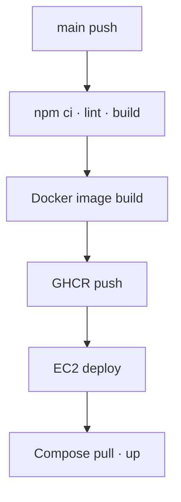
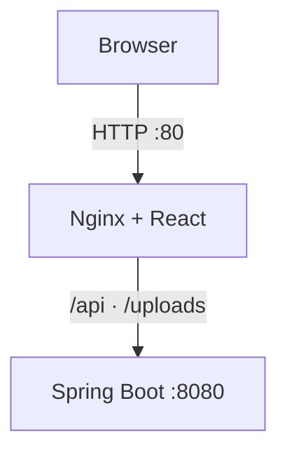

# 냐르륵 Frontend

고양이 감성과 보라색을 콘셉트로 한 커뮤니티 서비스 **냐르륵**의 React 프론트엔드 저장소입니다.

기존 Vanilla JavaScript 화면을 React의 컴포넌트와 State 중심 구조로 마이그레이션했습니다. Spring Boot REST API 및 JWT 인증과 연동했으며, 운영 환경에서는 멀티스테이지 Docker 이미지의 Nginx가 React 정적 파일을 제공하고 API 요청을 백엔드로 프록시합니다. `main` 브랜치 변경은 GitHub Actions를 통해 검증·이미지화된 뒤 AWS EC2에 자동 배포됩니다.

> 서비스 주소: `http://43.200.106.173`
> 현재 구성은 도메인과 HTTPS 없이 HTTP 80을 사용합니다.

## 주요 기능

| 영역 | 기능 |
| --- | --- |
| 인증 | 회원가입, 로그인, 로그아웃, JWT 만료 시 로그인 페이지 이동 |
| 회원 | 프로필 수정, 비밀번호 변경, 회원 탈퇴, 프로필 이미지 미리보기·업로드 |
| 게시글 | 목록·상세 조회, 작성, 수정, 삭제, 이미지 업로드 |
| 댓글 | 목록 조회, 작성, 수정, 삭제 |
| 권한 UI | 작성자에게만 게시글·댓글 수정 및 삭제 기능 노출 |
| 입력 검증 | 이메일, 비밀번호, 닉네임, 게시글 제목·내용 검증 |

프론트엔드의 버튼 숨김과 수정 페이지 접근 검사는 UX를 위한 1차 처리입니다. 실제 인가 여부는 백엔드가 인증 사용자와 작성자를 비교해 다시 검증합니다.

## 기술 스택

| 구분 | 기술 |
| --- | --- |
| UI | React |
| Build | Vite, Node.js 24, npm |
| Routing | React Router |
| HTTP | Fetch API |
| Style | CSS |
| Quality | ESLint |
| Web/Proxy | Nginx |
| Container | Docker, 멀티스테이지 빌드 |
| CI/CD | GitHub Actions, GitHub Container Registry |
| Infrastructure | AWS EC2, Elastic IP |

## 화면 구성

| 경로 | 화면 | 역할 |
| --- | --- | --- |
| `/login` | 로그인 | 이메일과 비밀번호로 로그인 |
| `/signup` | 회원가입 | 계정과 프로필 이미지 등록 |
| `/posts` | 게시글 목록 | 게시글 카드 목록 조회 |
| `/posts/:postId` | 게시글 상세 | 게시글과 댓글 조회·관리 |
| `/posts/new` | 게시글 작성 | 제목, 내용, 이미지 등록 |
| `/posts/:postId/edit` | 게시글 수정 | 기존 데이터 조회 후 작성자만 수정 |
| `/profile/edit` | 프로필 수정 | 닉네임과 프로필 이미지 변경 |
| `/password/edit` | 비밀번호 수정 | 비밀번호 변경 |

## 프로젝트 구조

```text
src/
├── api/              # 공통 HTTP 요청 및 도메인별 API 함수
├── assets/           # 이미지 등 정적 자원
├── components/       # Header, ProfileMenu, PostCard 등
├── pages/            # 라우트 단위 페이지 컴포넌트
├── styles/           # 공통·페이지별 CSS
├── App.jsx           # 최상위 컴포넌트와 라우팅
└── main.jsx          # React 애플리케이션 진입점
```

## 인증 및 요청 흐름

1. 로그인 성공 응답의 JWT Access Token과 사용자 식별 정보를 저장합니다.
2. 인증이 필요한 요청에 `Authorization: Bearer {token}`을 추가합니다.
3. `http.js`의 공통 요청 함수가 응답 상태와 JSON 변환을 처리합니다.
4. 페이지 컴포넌트가 API 결과를 State에 반영해 화면을 다시 렌더링합니다.
5. `401 Unauthorized`가 반환되면 인증 정보를 제거하고 로그인 페이지로 이동합니다.

Refresh Token을 사용하지 않으므로 Access Token이 만료되면 다시 로그인해야 합니다.

API 기본 주소는 다음과 같이 결정됩니다.

```js
const API_BASE_URL = import.meta.env.VITE_API_BASE_URL || "/api";
```

- 로컬: `.env`의 `http://localhost:8080/api`
- 운영: 같은 Origin의 `/api`

## 로컬 실행

### 요구 환경

- Node.js 24
- npm
- `http://localhost:8080`에서 실행 중인 백엔드

### 환경 변수

저장소 루트에 `.env`를 생성합니다.

```env
VITE_API_BASE_URL=http://localhost:8080/api
```

### 실행 및 검사

```bash
npm ci
npm run dev
```

```bash
npm run lint
npm run build
npm run preview
```

Vite 개발 서버의 기본 주소는 일반적으로 `http://localhost:5173`입니다.

## Docker와 Nginx

Dockerfile은 두 단계로 구성했습니다.

| 단계 | 역할 |
| --- | --- |
| Node build stage | 의존성 설치 후 Vite 운영 빌드 생성 |
| Nginx runtime stage | `dist/`만 복사해 정적 파일 제공 |

운영 이미지에 Node.js, 빌드 도구, 전체 소스를 포함하지 않아 이미지 크기와 불필요한 실행 요소를 줄였습니다.

```bash
docker build --build-arg VITE_API_BASE_URL=/api -t server-frontend .
docker run --rm -p 80:80 server-frontend
```

Nginx 요청 처리:

| 요청 | 대상 |
| --- | --- |
| `/` 및 정적 파일 | React 빌드 결과 |
| React Router 경로 | `try_files`로 `index.html` fallback |
| `/api/**` | `backend:8080` |
| `/uploads/**` | `backend:8080` |

브라우저는 Spring Boot의 8080 포트에 직접 접근하지 않고 HTTP 80의 Nginx만 사용합니다.

## CI/CD

`main` 브랜치에 반영된 코드는 GitHub Actions 워크플로를 통해 자동 검증 및 배포됩니다.



### CI 책임

1. 소스 체크아웃 및 Node.js 설정
2. `npm ci`로 lock 파일 기준 의존성 설치
3. ESLint와 Vite 운영 빌드로 코드 검증
4. 멀티스테이지 Docker 이미지 빌드
5. 커밋 SHA 등 변경되지 않는 태그와 배포용 태그를 GHCR에 게시

### CD 책임

1. CI가 성공한 경우에만 EC2 배포 단계 실행
2. SSH로 EC2에 접속해 GHCR 인증
3. 새 프론트엔드 이미지 pull
4. Docker Compose로 `frontend` 서비스 재생성
5. 컨테이너 상태 및 HTTP 응답 확인

## 배포 구조



- 외부 공개 포트: HTTP 80
- React 정적 파일: Nginx 제공
- API 및 이미지: Nginx가 백엔드 컨테이너로 프록시
- EC2 배포: GitHub Actions가 새 이미지 반영
