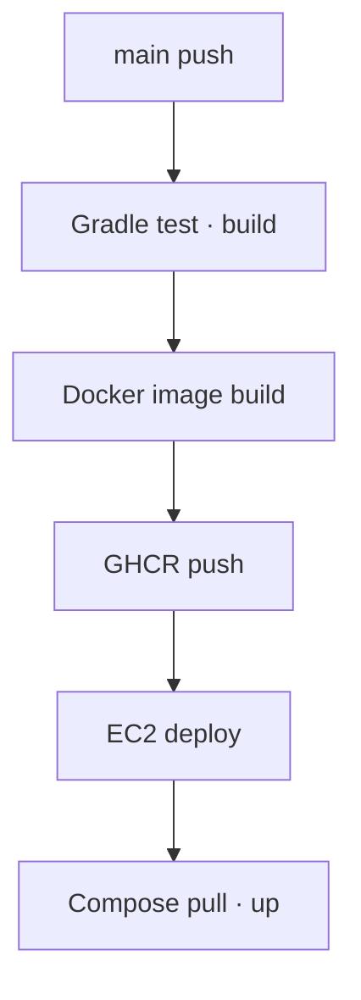

# 냐르륵 Backend

커뮤니티 서비스 **냐르륵**의 Spring Boot REST API 저장소입니다.

회원·게시글·댓글·이미지 API를 제공하며 Spring Security와 JWT Access Token으로 인증·인가를 처리합니다. 로컬에서는 H2, 운영 Docker Compose 환경에서는 MySQL을 사용합니다. `main` 브랜치 변경은 GitHub Actions에서 테스트와 빌드를 통과한 뒤 Docker 이미지로 만들어져 AWS EC2에 자동 배포됩니다.

> API 진입 주소: `http://43.200.106.173/api`  
> Spring Boot 8080 포트는 외부에 공개하지 않고 Nginx를 통해서만 접근합니다.

## 주요 기능

| 영역 | 기능 |
| --- | --- |
| 인증 | 로그인, 로그아웃, JWT Access Token 발급·검증 |
| 회원 | 회원가입, 조회, 프로필 수정, 비밀번호 변경, 회원 탈퇴 |
| 게시글 | 목록·상세 조회, 작성, 수정, 삭제, 이미지 업로드 |
| 댓글 | 목록 조회, 작성, 수정, 삭제 |
| 인가 | 인증 사용자와 리소스 작성자를 비교해 수정·삭제 검증 |
| 공통 | DTO 검증, 예외 처리, CORS, 업로드 파일 제공 |

## 기술 스택

| 구분 | 기술 |
| --- | --- |
| Language | Java 21 |
| Framework | Spring Boot |
| Web | Spring Web MVC |
| Security | Spring Security, JWT |
| Persistence | Spring Data JPA |
| Database | H2(local), MySQL(prod) |
| Validation | Jakarta Bean Validation |
| Build | Gradle, Gradle Wrapper |
| Container | Docker, 멀티스테이지 빌드 |
| CI/CD | GitHub Actions, GitHub Container Registry |
| Infrastructure | AWS EC2, Docker Compose, Nginx |

## 프로젝트 구조

```text
src/
├── main/
│   ├── java/.../community/
│   │   ├── auth/        # 로그인, JWT 필터와 토큰 처리
│   │   ├── user/        # 회원 도메인
│   │   ├── post/        # 게시글 도메인
│   │   ├── comment/     # 댓글 도메인
│   │   ├── file/        # 이미지 저장 및 조회
│   │   └── config/      # Security, CORS, Web 설정
│   └── resources/
│       ├── application.yml
│       ├── application-local.yml
│       └── application-prod.yml
└── test/                # 단위·통합 테스트
```

## 주요 API

| 도메인 | Method | 경로 | 설명 |
| --- | --- | --- | --- |
| 인증 | POST | `/api/auth/login` | 로그인 및 Access Token 발급 |
| 인증 | POST | `/api/auth/logout` | 로그아웃 응답 |
| 회원 | POST | `/api/users` | 회원가입 |
| 회원 | GET | `/api/users/{userId}` | 회원 조회 |
| 회원 | PATCH | `/api/users/{userId}` | 프로필 수정 |
| 회원 | DELETE | `/api/users/{userId}` | 회원 탈퇴 |
| 게시글 | GET | `/api/posts` | 게시글 목록 조회 |
| 게시글 | POST | `/api/posts` | 게시글 작성 |
| 게시글 | GET | `/api/posts/{postId}` | 게시글 상세 조회 |
| 게시글 | PATCH | `/api/posts/{postId}` | 게시글 수정 |
| 게시글 | DELETE | `/api/posts/{postId}` | 게시글 삭제 |
| 댓글 | GET | `/api/posts/{postId}/comments` | 댓글 목록 조회 |
| 댓글 | POST | `/api/posts/{postId}/comments` | 댓글 작성 |
| 댓글 | PATCH | `/api/posts/{postId}/comments/{commentId}` | 댓글 수정 |
| 댓글 | DELETE | `/api/posts/{postId}/comments/{commentId}` | 댓글 삭제 |

## 인증 및 인가 흐름

1. 이메일과 비밀번호로 로그인을 요청합니다.
2. 서버가 비밀번호를 검증하고 JWT Access Token을 발급합니다.
3. 클라이언트가 인증 요청에 `Authorization: Bearer {token}`을 포함합니다.
4. JWT 필터가 토큰을 검증하고 `SecurityContext`에 인증 객체를 저장합니다.
5. Spring Security 규칙과 서비스 계층의 작성자 검증이 요청을 허용하거나 거부합니다.
6. 유효한 인증이 없으면 `401`, 인증되었지만 권한이 부족하면 `403`을 반환합니다.

Refresh Token은 사용하지 않습니다. Access Token이 만료되면 사용자가 다시 로그인해야 합니다.

## 실행 환경 분리

| Profile | Database | 용도 |
| --- | --- | --- |
| `local` | H2 | 로컬 개발과 기능 확인 |
| `prod` | MySQL | Docker Compose 및 EC2 운영 환경 |

- `application.yml`: 공통 설정
- `application-local.yml`: H2 연결 설정
- `application-prod.yml`: 환경 변수 기반 MySQL·JWT·업로드 설정

## 로컬 실행

### 요구 환경

- JDK 21
- 저장소에 포함된 Gradle Wrapper

macOS/Linux:

```bash
SPRING_PROFILES_ACTIVE=local ./gradlew bootRun
```

Windows PowerShell:

```powershell
$env:SPRING_PROFILES_ACTIVE="local"
./gradlew.bat bootRun
```

기본 주소는 `http://localhost:8080`이며 로컬 DB는 H2를 사용합니다.

### 테스트 및 빌드

```bash
./gradlew test
./gradlew clean build
```

실행 가능한 JAR은 `build/libs/`에 생성됩니다.

## 운영 환경 변수

```env
SPRING_PROFILES_ACTIVE=prod
SPRING_DATASOURCE_URL=jdbc:mysql://db:3306/community_service
SPRING_DATASOURCE_USERNAME=<DB_USERNAME>
SPRING_DATASOURCE_PASSWORD=<DB_PASSWORD>
JWT_SECRET=<BASE64_ENCODED_RANDOM_SECRET>
JWT_EXPIRATION=3600000
FILE_UPLOAD_DIR=/app/uploads
```

## Docker 멀티스테이지 빌드

| 단계 | 역할 |
| --- | --- |
| JDK/Gradle build stage | 테스트 또는 빌드 후 실행 가능한 JAR 생성 |
| JRE runtime stage | JAR만 복사해 Spring Boot 실행 |

최종 이미지에서 빌드 도구와 전체 소스를 제외해 이미지 크기와 공격 표면을 줄였습니다.

```bash
docker build -t server-backend .
```

운영에서는 MySQL·환경 변수·Volume을 함께 구성하는 통합 Docker Compose로 실행합니다.

## Docker Compose 및 Nginx 연동

| 항목 | 구성 |
| --- | --- |
| Backend | `backend`, 내부 포트 8080 |
| Database | `db`, MySQL 내부 포트 3306 |
| DB 연결 | `jdbc:mysql://db:3306/community_service` |
| Upload path | `/app/uploads` |
| Spring profile | `prod` |

Compose 네트워크에서 `localhost`는 현재 컨테이너 자신이므로, Spring Boot는 호스트명이 아닌 서비스명 `db`로 MySQL에 연결합니다.

외부 요청 흐름:

- `/api/**` → Nginx → `backend:8080`
- `/uploads/**` → Nginx → `backend:8080`
- MySQL 3306과 Spring Boot 8080은 외부 미공개

## CI/CD

`main` 브랜치 push를 기준으로 백엔드를 검증하고 동일한 Docker 이미지를 Registry에서 EC2까지 전달합니다.



### CI 책임

1. 소스 체크아웃 및 Java 21 설정
2. Gradle Wrapper로 테스트와 빌드 수행
3. 테스트가 성공한 커밋으로 멀티스테이지 Docker 이미지 생성
4. 커밋 SHA 등 추적 가능한 태그와 배포용 태그를 GHCR에 push

### CD 책임

1. CI 성공 이후 SSH로 EC2 접속
2. GHCR에서 새 백엔드 이미지 pull
3. Docker Compose로 `backend` 서비스 재생성
4. MySQL과 업로드 Named Volume은 유지
5. 컨테이너 로그·상태 또는 API 응답 확인

GitHub Actions가 동일 저장소의 GHCR Package를 게시할 때는 `GITHUB_TOKEN`과 `packages: write` 권한을 사용할 수 있습니다. EC2에서 private 이미지를 pull할 때 필요한 토큰은 `read:packages` 범위만 부여하고 GitHub Secrets 또는 서버 환경 파일로 관리합니다. 서로 다른 저장소의 Workflow를 호출하거나 private Package에 접근하는 경우에만 해당 작업에 필요한 별도 PAT를 사용합니다.

## 보안 및 운영 원칙

- DB 비밀번호, JWT Secret, PAT, SSH 키를 저장소에 커밋하지 않습니다.
- Workflow의 `permissions`는 `contents: read`, `packages: write` 등 Job에 필요한 범위로 제한합니다.
- 비밀번호는 단방향 해시로 저장합니다.
- 요청의 사용자 ID만 신뢰하지 않고 인증 주체와 리소스 작성자를 비교합니다.
- 운영 CORS는 실제 프론트엔드 Origin만 허용합니다.
- MySQL 데이터와 업로드 파일은 Named Volume으로 영속화합니다.
- EC2 보안 그룹은 현재 서비스 진입점인 HTTP 80만 애플리케이션용으로 공개합니다.
